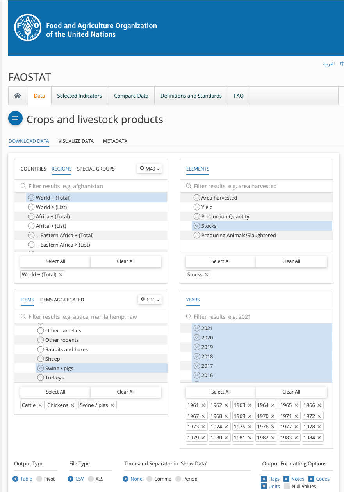
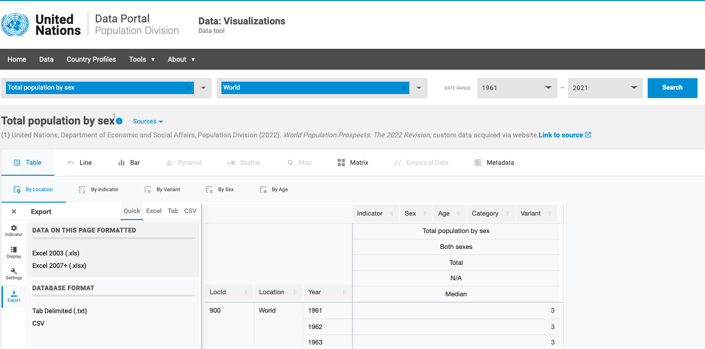
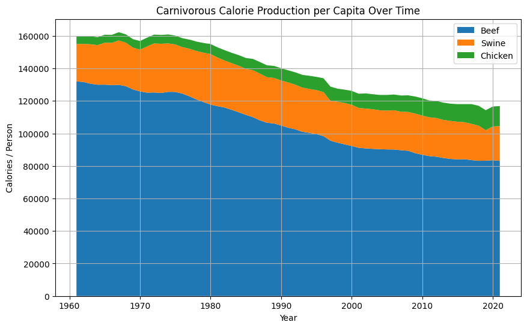

# Carnivore

### Introduction and Purpose

This notebook compares the world's most popular meat production (beef, chicken, and swine/pig) to the world's population over time (from the year $1961$ to the year $2021$). The goal is to determine whether food production is keeping up with global population growth.

### Meat Production

The world's meat production data was gathered from the [Food and Agriculture Organization of the United Nations](https://www.fao.org/faostat/en/#data/QCL). The following image displays the constraints used to derive the CSV of beef, chicken, and swine production data:

### Population

The world's population data was gathered from the [United Nations' Population Division](https://population.un.org/dataportal/data/indicators/49/locations/900/start/1961/end/2021/table/pivotbylocation). The following image displays the constraints used to derive the CSV of total human population:

### Takeaways

Maximum meat-calorie production was $162,000$ kcal per capita in the year $1967$. This means that everyone in the world could derive $457$ kcal of energy from meat per day. Since then, per capita meat-calorie production has decreased by $27.8\\%$ to $117,000$ kcal in $2021$. Thus, now everyone can only derive $321$ kcal of energy from meat per day.

These figures only account for front-end waste (i.e., discarded organs, bones, etc.). Imagine how many fewer calories the world actually derives from meat if we account for the back-end waste (i.e., unfinished steaks, rotten rotisserie chickens, etc.).
